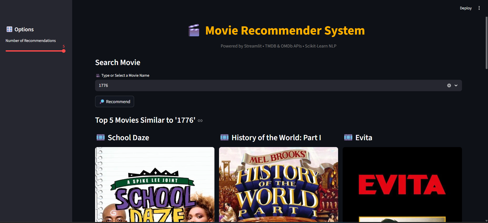

# 🎬 Movie Recommendation System

A content-based movie recommendation system built using NLP techniques and cosine similarity, deployed with Streamlit.

## 🎊 Example Screenshot


## ✨ Features
- 🔍 **Search any movie** and instantly get up to **5 similar movie recommendations**.
- 🎬 **Movie details** with posters, ratings, release date, and overview fetched dynamically from TMDB API.
- 🎥 **Trailer links** from YouTube and **fallback support using OMDb API** for missing data.
- 💾 **Precomputed recommendations** for lightning-fast responses (no recomputation needed).
- 🎨 Modern, responsive UI built with Streamlit — supports random movie suggestion and caching for performance.
- ⚡ **Caching and retry logic** ensures consistent performance even during API rate limits.

---

## 🛠 Tech Stack
- **Python 3.10+**
- **pandas**, **numpy** — data handling and preprocessing  
- **scikit-learn** — content-based recommendation using **CountVectorizer + cosine similarity**
- **Streamlit** — fast, interactive frontend web app
- **Requests** — to integrate **TMDB** and **OMDb APIs**
- **TMDB API** — for high-quality posters, trailers, and details
- **OMDb API** — fallback metadata for unavailable TMDB results


## 🌐 Live Demo
[Click here to view the app](https://movie-recommender-system-aynx.onrender.com/)

## 🚀 How to Run Locally

1. **Clone the repository**
    ```bash
    git clone https://github.com/your-username/movie-recommendation-system.git
    cd movie-recommendation-system
    ```

2. **Create a virtual environment & activate it**
    ```bash
    python -m venv venv
    # Windows
    venv\Scripts\activate
    # Mac/Linux
    source venv/bin/activate
    ```

3. **Install dependencies**
    ```bash
    pip install -r requirements.txt
    ```

4. **Run the Streamlit app**
    ```bash
    streamlit run app.py
    ```
## 📂 Project Structure
```plaintext
movie-recommendation-system/
│-- app.py                 # Main Streamlit app
│-- mrs_updated.ipynb       # Data preprocessing & similarity matrix generation
│-- movies.csv             # Dataset
│-- recommendations.csv    # Precomputed recommendations
│-- asset/                 # Assets like images and screenshots
│-- requirements.txt       # Python dependencies
│-- README.md              # Project documentation


